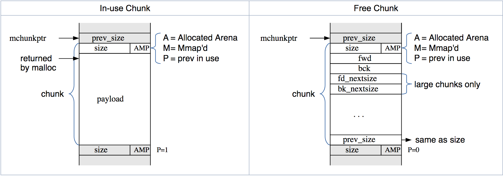

# Understanding the Heap
> One Heap to malloc them all, One Heap to free them, One Heap to coalesce, and in the memory bind them...

I am assuming the you have good knowledge of **C's `malloc` and `free`** functions before going ahead. This is the introductory lecture on Heap exploiation, and this covers how the heap is managed by the application. This lecture covers the `glibc` implementation in heap management.  
What I am planning to cover in this lecture:
1. Heap and dynamic memory management functions?
    * `malloc` & `free` fundamentally.
2. `sbrk` & `mmap`
2. Arena
3. Bins
4. Chunks
5. Simple exploit demonstrating how fooling **`fastbins`** are.

### Heap

Heap is the part of memory which is used to store the variables that are dynamically created using `*alloc` family of functions. You should not get confused with the dynamic variable to that of the variables to that onto the stack. The variables on to the stack are also allocated during run-time but in case of heap they are created during run-time by `*alloc` family functions.
The memory created in this segment is global, in terms that any function/thread in the program can share that memory. They are handled with pointers. If you are not too handy with pointers, you can refer [this guide]() before going forward.  
The following diagram shows how the application performs memory management calls and which of its components are system (in)/dependent.
```
                             +--------------+
                             | Application  |
                             +------+-------+
                                    |
                                    |
                                    |
                             +------v-------+    System independent glibc
                             |    malloc    |    implementation
                          +--+--------------+--+
                          |                    |
                          |                    |
                          |                    |
                    +-----v------+     +-------v-----+
                    |    _brk    |     |    _mmap    |  System specific heap
                    +------------+     +-------------+  management calls
```
`brk` obtains memory (non zero initialized) from kernel by increasing program break location (brk). Initially start (`start_brk`) and end of heap segment (`brk`) would point to same location. `start_brk` points to the segment in memory that points to the end of the BSS(in case the ASLR is turned off) during the program run. The value for programs `start_brk` can be obtained using `sbrk()` system call, by passing the argument `0` in it.
Lets see how the call `sbrk` works.
```C
#include <stdio.h>
#include <unistd.h>
#include <sys/types.h>

int main()
{
    printf("Current program pid %d\n", getpid());
    printf("Current break location %p\n", sbrk(0));
    //used to increment and decrement program break location
    brk(sbrk(0) + 1024);
    printf("Current break location %p\n", sbrk(0));
    getchar();
    return 0;
}
```

```bash
Current program pid 10316
Current break location 0x9380000    <----- Current brk
Current break location 0x9380400
```

And this is how the process looks like in memory.
```bash
$ cat /proc/10316/maps/
08048000-08049000 r-xp 00000000 00:27 45                                 /vagrant/Lecture7/brk_test
08049000-0804a000 r--p 00000000 00:27 45                                 /vagrant/Lecture7/brk_test
0804a000-0804b000 rw-p 00001000 00:27 45                                 /vagrant/Lecture7/brk_test
0935f000-09381000 rw-p 00000000 00:00 0                                  [heap]     <------------------- Heap segment
...
```
`0935f000-09381000` is Virtual address range for this segment,  
`rw-p` is Flags (Read, Write, Non-Xecute, Private)  
`00000000` is File offset – Since its not mapped from any file, its zero here  
`00:00` is Major/Minor device number – Since its not mapped from any file, its zero here  
`0` is inode number – Since its not mapped from any file, its zero here  

Since `sbrk` and `brk` are used to get/set the offset of program break on the other hand `mmap` is used to get the memory from the kernel to add it to the heap and update the program `brk`.
The functions that we have discussed so far are able to manage the heap memory. Now we will clear out the picture of `Heap` a bit.


### Organization of Heap.

Heap have different allocation units implemented by `glibc` that helps for easy heap manipulation. These different allocation units are Areans, Bins, Chunks.

#### Arenas:
In order to efficiently handle multi-threaded applications, `glibc's malloc` allows for more than one region of memory to be active at a time. Thus, different threads can access different regions of memory without interfering with each other. These regions of memory are collectively called `arenas`.
There is one arena, the `main arena`, that corresponds to the application's initial heap. There's a static variable in the `malloc` code that points to this arena, and each arena has a next pointer to link additional arenas.
To understand, the physical heap (allocated to VA) is division-ed into arenas. The main arena, starts just after the program break `start_brk`. Arena contains collections of bins in it.


#### Bins:
They are the collection of free memory allocation units called `chunks`. There are 4 different types of bins present in one arena specific to requirement. And each bin contains, allocation data structure that keeps track of free chunks. ** No arena (basically the bins in the arena) keeps track of allocated chunks **. Each arena have specific count of specific bin in it. 

The four types of bins are:
1. **Fast**. 
    There are 10 fast bins. Each of these bins maintains a single linked list. Addition and deletion happen from the front of this list (LIFO manner). Each bin has chunks of the same size. The 10 bins each have chunks of sizes: 16, 24, 32, 40, 48, 56, 64 bytes etc. No two contiguous free fast chunks coalesce together.

2. **Unsorted**. 
    When small and large chunks are free'd they're initially stored in a this bin. There is only 1 unsorted bins. 

3. **Small**. 
    The normal bins are divided into "small" bins, where each chunk is the same size, and "large" bins, where chunks are a range of sizes. When a chunk is added to these bins, they're first combined with adjacent chunks to "coalesce" them into larger chunks. Thus, these chunks are never adjacent to other such chunks (although they may be adjacent to fast or unsorted chunks, and of course in-use chunks). Small and large chunks are doubly-linked so that chunks may be removed from the middle (such as when they're combined with newly free'd chunks). 

4. **Large**. 
    A chunk is "large" if its bin may contain more than one size. For small bins, you can pick the first chunk and just use it. For large bins, you have to find the "best" chunk, and possibly split it into two chunks (one the size you need, and one for the remainder).

#### Chunks:
Chunks are the fundamental allocation unit in bins. The memory in the heap is divided into chunks of various sizes depends on where they are allocated (in which bin). Each chunk includes meta-data about how big it is (via a size field in the chunk header), and thus where the adjacent chunks are. When the chunk is free'd, the memory that used to be application data is re-purposed for additional arena-related information, such as pointers within linked lists, such that suitable chunks can quickly be found and re-used when needed. The size of chunk is always in multiple of 8, that allows last three bits to be used as flags. 

These three flags are:
- **A**
    Allocated Arena - the main arena uses the application's heap. Other arenas use mmap'd heaps. To map a chunk to a heap, you need to know which case applies. If this bit is 0, the chunk comes from the main arena and the main heap. If this bit is 1, the chunk comes from mmap'd memory and the location of the heap can be computed from the chunk's address. 
- **M**
    MMap\'d chunk - this chunk was allocated with a single call to mmap and is not part of a heap at all. 
- **P**
    Previous chunk is in use - if set, the previous chunk is still being used by the application, and thus the prev_size field is invalid. Note - some chunks, such as those in fastbins (see below) will have this bit set despite being free'd by the application. This bit really means that the previous chunk should not be considered a candidate for coalescing - it's "in use" by either the application or some other optimization layered atop malloc's original code :-)

The chunk may look like the following:


### Allocation of small/medium bins:
`glibc` malloc uses first fit algorithm for the allocation of chunks in small/large bins. In this implementation as the name suggest, the first suitable free location of memeory which is capable of handing the new request size will split according to the requirement and will be allocated to the new request.
Let see what's going on `use after free exploit`

```C
#include <stdio.h>
#include <stdlib.h>
#include <string.h>

int main()
{
	printf("If a chunk is free and large enough, malloc will select this chunk.\n");
	printf("This can be exploited in a use-after-free situation.\n");

	char* a = malloc(512);
	char* b = malloc(256);
	char* c;

	printf("1st malloc(512): %p\n", a);
	printf("2nd malloc(256): %p\n", b);
	strcpy(a, "this is A!");
	printf("first allocation %p points to %s\n", a, a);

	printf("Freeing the first one...\n");
	free(a);

	printf("We don't need to free anything again. As long as we allocate less than 512, it will end up at %p\n", a);

	printf("So, let's allocate 500 bytes\n");
	c = malloc(500);
	printf("3rd malloc(500): %p\n", c);
	printf("And put a different string here, \"this is C!\"\n");
	strcpy(c, "this is C!");
	printf("3rd allocation %p points to %s\n", c, c);
	printf("first allocation %p points to %s\n", a, a);
	printf("If we reuse the first allocation, it now holds the data from the third allocation.");
}
```
Run the program and notice that, the pointer `c` and pointer `a` points to the same location.
With small and large chunks/bins there is a hope for use after free exploit. In which the pointer which is freed can be exploited even after it is freed.

### Fast bin allocation:
As I told earlier that fatsbins are maintained as single linked list. When I mention maintains "fastbins are maintained" then I am talking about, the free chunks. **Always remember bins point to free chunks** only not to the allocated chunks. It is the responsiblity of programmmer to take care of allocated chunks and free then when they are not in use.
When a chunk is freed, it added to the head of the fast bin list and when it is allocated the head node chunk is removed from the list and is up for allocation.
If not properly maintained fastbins can be exploited to run `double free` exploits. In which programmer by mistake frees a memory twics and the attacker can leverage it to do something malicious.
Look at the following code.
```C
#include <stdio.h>
#include <stdlib.h>
int main()
{
	void *a, *b, *c, *d, *e, *f;
	a = malloc(32);       
	b = malloc(32);
	c = malloc(32);

	printf("%p %p %p\n", a, b, c);
	free(a);                                //fastbin head -> a > tail
	//To avoid double free correction or fasttop check, free something other than a 
	free(b);                                //fastbin head b -> a > tail
	free(a);                                //fastbin head a -> b -> a > tail

	d = malloc(32);                         //fastbin head -> b -> a -> tail first a popped
	e = malloc(32);                         //fastbin head -> a -> tail first b popped
	f = malloc(32);                         //fastbin head -> tail second a popped
	printf("%p %p %p", d, e, f);
	return 0;
}
```
This will make pointers `d` and `f` points to same memory location. This is called double free exploit. 

